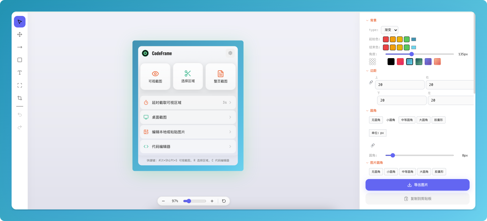
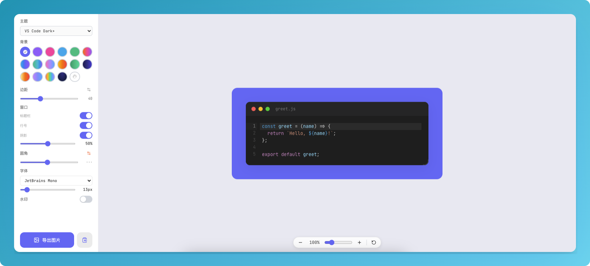

<p align="center">
  
</p>

<h1 align="center">CodeFrame</h1>

<p align="center">
  <strong>代码美化截图工具 - 截图标注与代码美化于一体的 Chrome 扩展</strong>
</p>

<p align="center">
  <a href="#功能特性">功能特性</a> •
  <a href="#安装">安装</a> •
  <a href="#使用说明">使用说明</a> •
  <a href="#开发">开发</a> •
  <a href="#贡献">贡献</a>
</p>

<p align="center">
  
  
  
  
</p>

<p align="center">
  <a href="README.md">English</a>
</p>

---

## 预览

| 弹窗页面 | 图片编辑器 | 代码美化器 |
|:--------:|:----------:|:----------:|
|  |  |  |

---

## 功能特性

### 📸 截图捕获

| 功能 | 描述 |
|------|------|
| 区域截图 | 自由选择屏幕区域进行截图 |
| 可视区域截图 | 截取当前浏览器窗口可视内容 |
| 整页截图 | 自动滚动拼接生成完整长截图 |
| 桌面截图 | 截取桌面其他应用窗口 |
| 延迟截图 | 定时截图，支持 3/5/10 秒延迟 |

### ✏️ 图片标注

| 功能 | 描述 |
|------|------|
| 箭头工具 | 绘制指向性箭头，支持多种样式 |
| 形状工具 | 矩形、圆形标注 |
| 文字工具 | 添加文字标注，支持字体/大小/颜色调整 |
| 马赛克工具 | 模糊敏感信息区域 |
| 撤销/重做 | 多步撤销和重做操作 |

### 💻 代码美化

| 功能 | 描述 |
|------|------|
| 代码输入 | 支持手动输入、粘贴、拖拽文件 |
| 语法高亮 | 高质量语法高亮，支持 180+ 语言 |
| 主题选择 | 内置 30+ 代码主题 |
| 渐变背景 | 多种预设渐变背景 + 自定义 |
| 窗口样式 | macOS/Windows 风格窗口框架 |
| 行高亮 | 高亮指定代码行 |

### 📤 导出分享

| 功能 | 描述 |
|------|------|
| 多格式导出 | PNG/JPG/WEBP 格式 |
| 复制到剪贴板 | 一键复制到系统剪贴板 |
| 本地下载 | 下载到本地文件系统 |

---

## 安装

### Chrome 商店安装（推荐）

> 待上架

### 本地开发安装

1. **克隆仓库**

```bash
git clone https://github.com/xie392/CodeFrame.git
cd CodeFrame
```

2. **安装依赖**

```bash
pnpm install
```

3. **构建扩展**

```bash
pnpm build
```

4. **加载到 Chrome**

- 打开 Chrome，访问 `chrome://extensions/`
- 开启右上角的「开发者模式」
- 点击「加载已解压的扩展程序」
- 选择项目的 `dist` 目录

---

## 使用说明

### 快捷键

| 快捷键 | 功能 |
|--------|------|
| `Alt + Shift + S` | 截取可视区域 |
| `Alt + Shift + R` | 选择区域截图 |
| `Alt + Shift + F` | 整页截图 |
| `Alt + Shift + D` | 桌面截图 |

### 基础操作流程

```
┌─────────────┐     ┌─────────────┐     ┌─────────────┐
│   截图捕获   │ ──→ │   图片标注   │ ──→ │   导出分享   │
└─────────────┘     └─────────────┘     └─────────────┘
```

1. 点击浏览器工具栏的 CodeFrame 图标
2. 选择截图方式（区域/可视区域/整页/桌面）
3. 在编辑器中添加标注（箭头/文字/马赛克等）
4. 导出或复制到剪贴板

### 代码美化

1. 点击图标打开 CodeFrame
2. 切换到「代码」标签页
3. 粘贴或输入代码
4. 选择主题、背景、字体等样式
5. 点击导出或复制

---

## 开发

### 技术栈

| 类别 | 技术 |
|------|------|
| 框架 | React 18 + TypeScript |
| 构建 | Vite + CRXJS |
| 样式 | TailwindCSS |
| 代码高亮 | Shiki |
| Canvas | Konva.js |
| 状态管理 | Zustand |
| 扩展规范 | Manifest V3 |

### 本地开发

```bash
# 安装依赖
pnpm install

# 启动开发服务器
pnpm dev

# 构建生产版本
pnpm build

# 代码检查
pnpm lint

# 运行测试
pnpm test

# 类型检查
pnpm typecheck
```

### 项目结构

```
src/
├── background/     # Service Worker
├── popup/          # 主弹窗
├── editor/         # 图片编辑器
├── codegen/        # 代码生成器
├── content/        # 内容脚本
├── shared/         # 共享模块
└── options/        # 设置页
```

---

## 贡献

我们欢迎所有形式的贡献！

### 贡献方式

1. Fork 本仓库
2. 创建功能分支 (`git checkout -b feature/amazing-feature`)
3. 提交更改 (`git commit -m 'feat: add amazing feature'`)
4. 推送到分支 (`git push origin feature/amazing-feature`)
5. 创建 Pull Request

### 代码规范

- 遵循 ESLint + Prettier 配置
- 单行长度 ≤ 80 字符
- 提交信息遵循 [Conventional Commits](https://www.conventionalcommits.org/)

### 开发指南

- 新代码 < 100 行
- 纯函数优先
- 单一职责原则
- 无 `any` 类型

---

## 许可证

本项目基于 [MIT](LICENSE) 许可证开源。

---

## 特别说明

本项目所有代码均通过 **Vibe Coding** 完成，全部由 AI 辅助生成。🤖✨

---

<p align="center">
  Made with ❤️ by <a href="https://github.com/xie392">xie392</a>
</p>
